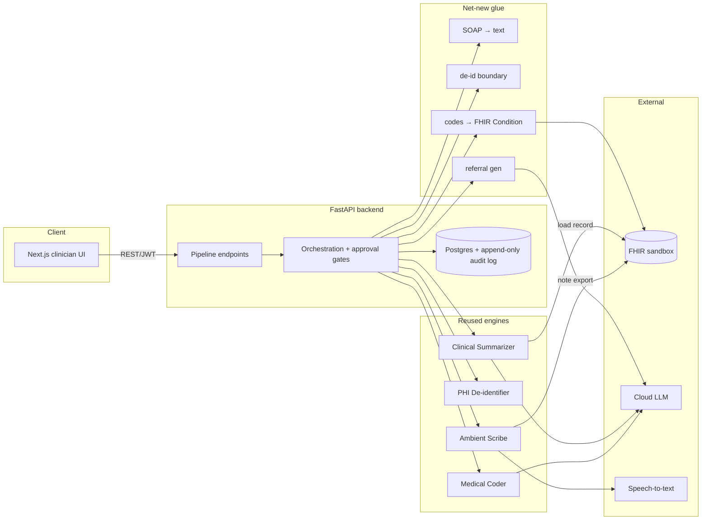

# Clinical Documentation Assistant

A full-stack demo that takes a doctor's consultation from **audio to a
finished, clinician-approved medical record**:

```
record → transcribe → SOAP note → suggested billing codes → referral letter → FHIR write-back
```

...all behind an edit-and-approve web UI, with an append-only audit trail
covering every AI-generated draft and every human edit.

> **Synthetic data only.** This is a demo, not a real clinical system. Never
> enter real patient information. The synthetic-data banner is always on.

---

## How it's built

This repo is the **product layer**: a FastAPI backend + Next.js web UI that
composes four independently-built AI engines into one working application.
Each engine is its own open-source project with its own tests and docs:

| Engine | What it does | Repo |
|---|---|---|
| **Ambient Scribe** | Turns consultation audio into a transcript and a structured SOAP note | [ai-ambient-scribe](https://github.com/sovorn-c/ai-ambient-scribe) |
| **PHI De-identifier** | Strips identifying information from clinical text before it reaches any cloud AI call | [phi-deidentifier](https://github.com/sovorn-c/phi-deidentifier) |
| **Medical Coder** | Suggests ranked ICD-10-CM billing codes from a note | [auto-medical-coder](https://github.com/sovorn-c/auto-medical-coder) |
| **Clinical Summarizer** | Turns a patient's FHIR record into a plain-language summary | [fhir-clinical-summarizer](https://github.com/sovorn-c/fhir-clinical-summarizer) |

The work in *this* repo is the orchestration, approval gating, data layer,
audit log, and clinician UI that wires those four engines together — plus a
small glue layer (`packages/clin_core_glue/`) for the pieces that don't exist
anywhere yet: flattening a SOAP note for the coder, the de-identification
boundary, referral-letter generation, and mapping approved codes to FHIR
`Condition` resources.



| Layer | Location | Role |
|---|---|---|
| Clinician UI | `frontend/` | Guided flow: patient → record → transcript → edit SOAP → codes → referral → approve → export |
| Backend API | `backend/clin_doc/` | Pipeline endpoints, orchestration, approval gating, JWT auth |
| Data layer + audit | `backend/clin_doc/db/` | Database tables + an append-only audit log |
| Glue | `packages/clin_core_glue/` | SOAP→text, de-id boundary, referral gen, codes→FHIR |
| Infra | `infra/`, `docker-compose.yml` | Docker, deploy |

### Trust boundary & de-identification

The clinician-facing copy (database + UI) stays **un-redacted** — a clinician
needs real patient identifiers to chart. Before any text crosses into a
**cloud LLM call** (billing-code suggestions or referral-letter generation),
the PHI de-identifier runs on that copy only. Transcription and note drafting
happen entirely locally, so no de-identification is needed there. The audit
log records each de-identification event as privacy-safe counts — never the
underlying PHI value.

### The LLM is not locked to any one provider

Every cloud AI call goes through [LiteLLM](https://docs.litellm.ai/), so
switching model providers is a `.env` edit, not a code change — Anthropic,
OpenAI, Gemini, or a local model via Ollama all work the same way. See
[Environment](#environment) below.

---

## Try it

The full local build requires cloning the four engine repos above alongside
this one (see [Run it yourself](#run-it-yourself)) — they're linked above
mainly so you can browse each engine on its own. A hosted demo link will be
added here once deployed; see [`docs/DEPLOY.md`](docs/DEPLOY.md) for the
deployment plan in the meantime.

## Run it yourself

### Prerequisites

- Python 3.11 + [`uv`](https://docs.astral.sh/uv/)
- Node 20+
- Docker (for the full-stack compose run)
- The four engine repos above, cloned as siblings of this repo (the backend
  depends on them as local path dependencies). The parent folder can be named
  anything — only the sibling layout and each repo's default clone name
  matter:

  ```
  any-folder-name-you-want/
  ├── clinical-documentation-assistant/   ← this repo
  ├── ai-ambient-scribe/
  ├── phi-deidentifier/
  ├── auto-medical-coder/
  └── fhir-clinical-summarizer/
  ```

### Local dev (backend + frontend)

Quickest path on Apple Silicon: `./dev.sh` — installs/starts Ollama and pulls
the local drafting model, starts Postgres, installs deps, runs migrations +
seed, and brings up the backend (mlx-whisper + local Ollama) and frontend
together. `./stop.sh` tears the containers back down. To do it manually
instead (e.g. on Linux, or against a cloud LLM):

```bash
# Backend — installs the four engines via editable path deps + their transitive
# deps (torch, chromadb, spaCy + en-core-web-lg, sentence-transformers).
cp .env.example .env          # set API_KEY for codes/summary/referral; set a real JWT_SECRET
docker compose up -d db       # Postgres only — dev uses the same DB as production
uv sync --all-packages --extra local-mac   # Apple Silicon (mlx-whisper); use --extra cloud elsewhere

# Tables + demo clinician — needed once per fresh Postgres volume. This one
# command has to run with backend/ as the cwd (alembic.ini's script_location
# is a relative path); everything else here runs from the repo root instead,
# so uvicorn's --reload-dir flags below can target packages/clin_core_glue.
(cd backend && uv run alembic upgrade head && uv run python -m clin_doc.seed)

uv run --project backend uvicorn clin_doc.main:app --reload \
  --reload-dir backend/clin_doc --reload-dir packages/clin_core_glue  # :8000
```

The `--reload-dir` flags matter: without them, `--reload` watches the entire
repo root, including `.venv`, `uploads/`, and any model/index caches — a
`uv sync` or an audio upload can then trigger a mid-request server restart.

`DATABASE_URL` defaults to Postgres so local dev matches production — on
Postgres, tables and the demo clinician only exist once you've run the
migration + seed step above. SQLite (`DATABASE_URL=sqlite:///./clindoc.db`)
also works as a no-Docker fallback and seeds itself automatically on startup,
but isn't the documented path — it skips the secrets guard (see
[Security](#security)) and behaves slightly differently at the SQL level.

```bash
# Frontend
cd frontend && npm install && npm run dev   # :3000, proxies /api → :8000
```

Open http://localhost:3000 → sign in as `clinician` / `changeme`.

### Full stack via Docker

```bash
cp .env.example .env          # set API_KEY
docker compose up --build     # frontend :3000, backend :8000, Postgres :5432
```

See [`docs/DEPLOY.md`](docs/DEPLOY.md) for the build-context constraint (the
backend image needs the four sibling repos in its build context), the ASR
strategy, managed Postgres, and deploy targets.

---

## The clinician flow (demo walkthrough)

1. **Sign in** — `clinician` / `changeme` (seeded demo clinician).
2. **Patients** — add a patient (FHIR id + display name + optional FHIR bundle
   for context). "Summarize" runs the Clinical Summarizer over the bundle.
   "Start encounter" begins a consultation.
3. **Upload audio** — choose the recorded consultation audio; the backend
   persists it.
4. **Transcribe & draft note** — the Ambient Scribe transcribes and drafts a
   SOAP note.
5. **Review transcript + edit SOAP** — toggle "Diff vs AI draft" to see your
   edits against the AI output (line-level diff). Save.
6. **Suggest codes** — the Medical Coder ranks ICD-10-CM codes over the
   de-identified note.
7. **Generate referral** — an LLM call generates a referral letter over the
   de-identified note + patient context.
8. **Approve** — note, codes, and referral each get an approval record.
9. **Export to FHIR** — gated: blocked until the required approvals exist.
   Exports the note plus one FHIR `Condition` per approved code.
10. **Audit trail** — every state change, with AI-vs-human before/after diffs
    and de-identification event counts.

Every step is recorded in the append-only audit log (one row per write, by
construction — not caller discipline).

---

## Project structure

```
clinical-documentation-assistant/
├── backend/
│   ├── clin_doc/            # FastAPI app: routers, services, db, auth, asr, rate_limit, seed
│   ├── alembic/             # Migrations
│   ├── packages/clin_core_glue/  # (workspace member) the net-new glue pieces
│   └── tests/               # 48 tests: smoke, db round-trip, glue, API, deployment, security
├── frontend/                # Next.js 15 + Tailwind clinician UI
├── infra/                   # Dockerfile.backend, Dockerfile.frontend, entrypoint.sh
├── docs/                    # ARCHITECTURE.md, DEPLOY.md
└── docker-compose.yml
```

---

## Testing

```bash
uv run --project backend pytest backend/tests
```

| Suite | Covers |
|---|---|
| `test_smoke_engines.py` | All four engines importable + callable |
| `test_db_roundtrip.py` | Every data type round-trips through the schema; every write is audited |
| `test_glue.py` | SOAP→text, de-id boundary, referral gen, codes→FHIR |
| `test_api.py` | Full pipeline flow via HTTP with injectable fakes; approval gating; validation errors |
| `test_phase5.py` | ASR backend swap output mapping; rate limiting |
| `test_phase6.py` | CORS allowlist; production secrets guard |

Engine calls that need models/keys (coding, summarizing, referral LLM) are
faked in the API tests; the scribe's export path runs for real (no LLM) over
a fake transcriber; the de-identification boundary runs for real (rules-only).
This proves orchestration, gating, audit, and de-id placement — model
inference itself is verified at deploy time.

---

## Security

- **Auth:** JWT + bcrypt password hashing. A single demo clinician is seeded
  (`clinician`/`changeme`) — override the seed env vars in any real deployment.
- **Authz model:** single-tenant demo. The current user is the approver of
  record on every approval; there is no cross-tenant isolation (one clinician,
  synthetic data). Multi-tenant isolation is out of scope for the demo.
- **CORS:** explicit origin allowlist, not a wildcard + credentials.
- **Secrets hygiene:** the app refuses to boot a non-SQLite database with the
  default JWT secret in production.
- **De-identification:** runs on every copy of text that crosses into a cloud
  LLM call. The audit log records counts only, never the PHI value.
- **Rate limiting:** in-process sliding-window limiter for the public demo.
- **Input validation:** note edits are schema-validated before persisting.

See [`docs/ARCHITECTURE.md`](docs/ARCHITECTURE.md) for the full design and
trust boundary, and [`docs/DEPLOY.md`](docs/DEPLOY.md) for deployment.

---

## Environment

See [`.env.example`](.env.example) for the full contract. Key variables:

| Variable | Purpose |
|---|---|
| `API_KEY` | Shared cloud LLM key — key for whichever provider you set below |
| `LLM_MODEL` | Summarizer + referral generation — LiteLLM `"<provider>/<model>"`, not locked to any one provider (`openai/gpt-5`, `gemini/gemini-2.5-pro`, `ollama/llama3`, ...) |
| `MODEL` | Medical coder — same LiteLLM `"<provider>/<model>"` convention |
| `DATABASE_URL` | Postgres in production / SQLite by default for local dev |
| `JWT_SECRET` | Auth (guarded in production) |
| `ASR_BACKEND` | `faster_whisper` (cloud) or `mlx_whisper` (local Apple Silicon dev) |
| `RATE_LIMIT_ENABLED` | Public-demo throttle |

Never commit `.env`.

---

## Status

Feature-complete: transcription, SOAP drafting, coding, referral generation,
FHIR export, auth, approval gating, an audit trail, and a Dockerized deploy
are all in place and tested. Not yet deployed to a public URL — see
[`docs/DEPLOY.md`](docs/DEPLOY.md) for the deployment plan.
