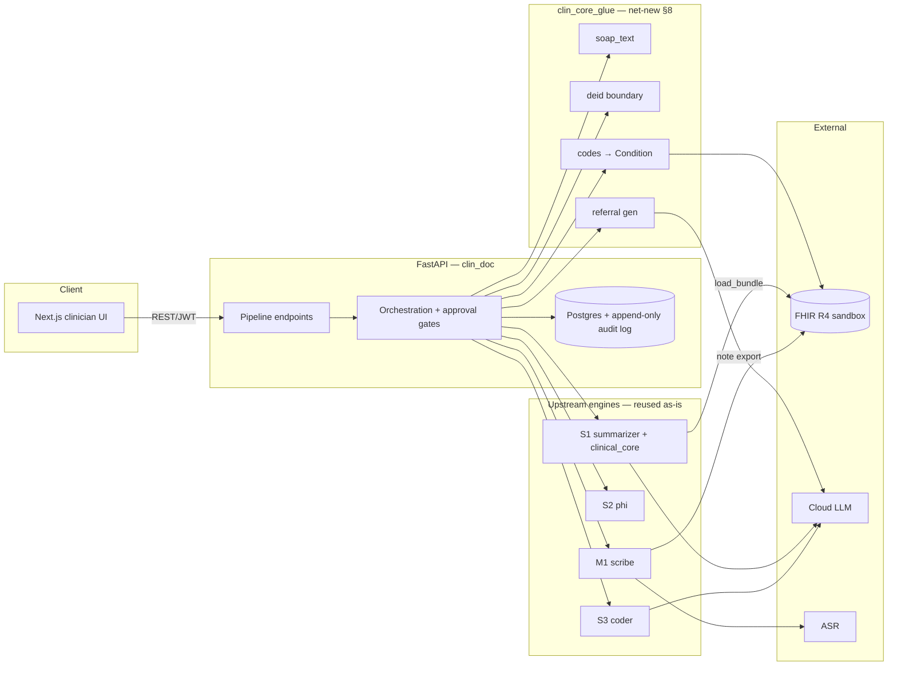

# Clinical Documentation Assistant (B1)

A full-stack product that takes a consultation from **audio to FHIR**, with a
clinician in the loop the whole way:

```
record → transcribe → SOAP note → suggested codes → referral letter → FHIR write-back
```

…all behind an edit-and-approve UI with an append-only audit trail. It integrates
four earlier portfolio projects — an ambient scribe (M1), a PHI de-identifier
(S2), an auto medical coder (S3), and a FHIR clinical summarizer (S1) — into one
deployable application. The work here is **wiring** plus four net-new pieces, not
re-engineering the engines.

> **Synthetic data only.** This is a demo. Never enter real patient information.
> The banner is always on (`SYNTHETIC_DATA_ONLY=true`).

---

## Architecture



| Layer | Location | Role |
|---|---|---|
| Clinician UI | `frontend/` | Guided flow: patient → record → transcript → edit SOAP → codes → referral → approve → export |
| FastAPI backend | `backend/clin_doc/` | Pipeline endpoints, orchestration, approval gating, JWT auth |
| Data layer + audit | `backend/clin_doc/db/` | SQLModel tables shaped to upstream types; append-only audit log |
| Net-new glue | `packages/clin_core_glue/` | SOAP→text, de-id boundary, referral gen, codes→FHIR |
| Infra | `infra/`, `docker-compose.yml` | Docker, deploy |

### Trust boundary & de-identification

The clinician-facing canonical copy (DB + UI) stays **un-redacted** — a clinician
needs real identifiers to chart. Before any text crosses into a **cloud LLM**
call — `suggest-codes` (S3) or `generate-referral` (net-new) — S2's
`deidentify()` runs on that copy only. M1's note drafting is 100% local
(mlx-whisper/ollama or faster-whisper/ollama), so no de-id is needed there. The
audit log records each de-id event with privacy-safe counts (never the PHI value).

### Two Phase 0 decisions (locked, written down in `docs/ARCHITECTURE.md`)

- **FHIR version:** R4 is canonical for context loading (S1 `load_bundle`) and
  the net-new `Condition`/`Claim` mapping; M1's R5 `DocumentReference` is reused
  as-is for note export. The two are exported as separate resources, so no
  version-mixed bundle is produced.
- **ASR strategy:** local dev uses M1's `mlx-whisper` (Apple Silicon); the cloud
  demo swaps to `faster-whisper` (CTranslate2, CPU, same Whisper weights) via a
  B1 adapter conforming to M1's `Transcriber` ABC — not a rewrite of M1.

---

## Quickstart

### Prerequisites

- Python 3.11 + [`uv`](https://docs.astral.sh/uv/)
- Node 20+
- Docker (for the full-stack compose run)
- The four sibling engine repos cloned alongside this one under
  `clinical-ai-portfolio/` (the backend depends on them as local path deps):
  `ai-ambient-scribe`, `phi-deidentifier`, `auto-medical-coder`,
  `fhir-clinical-summarizer`.

### Local dev (backend + frontend, no engines running)

```bash
# Backend — installs the four engines via editable path deps + their transitive
# deps (torch, chromadb, spaCy + en-core-web-lg, sentence-transformers).
cp .env.example .env          # set API_KEY for codes/summary/referral
uv sync --all-packages
uv run --project backend pytest backend/tests        # 48 tests
uv run --project backend uvicorn clin_doc.main:app --reload  # :8000
```

```bash
# Frontend
cd frontend && npm install && npm run dev   # :3000, proxies /api → :8000
```

Open http://localhost:3000 → sign in as `clinician` / `changeme` (seeded on
SQLite startup).

### Full stack via Docker

```bash
cp .env.example .env          # set API_KEY
docker compose up --build     # frontend :3000, backend :8000, Postgres :5432
```

The backend image builds with the context set to the **parent** directory (the
four engines are path deps to sibling repos outside this workspace) and bakes
S3's ICD-10-CM catalogue + Chroma index at build time. See
[`docs/DEPLOY.md`](docs/DEPLOY.md) for the build-context constraint, the ASR
strategy, managed Postgres, and deploy targets.

---

## The clinician flow (demo walkthrough)

1. **Sign in** — `clinician` / `changeme` (seeded demo clinician).
2. **Patients** — add a patient (FHIR id + display name + optional R4 bundle
   path for context). "Summarize" runs S1 over the bundle. "Start encounter"
   begins a consultation.
3. **Upload audio** — choose the recorded consultation audio; the backend
   persists it.
4. **Transcribe & draft note** — M1 transcribes (faster-whisper in the cloud)
   and drafts a SOAP note.
5. **Review transcript + edit SOAP** — toggle "Diff vs AI draft" to see your
   edits against the AI output (line-level diff). Save.
6. **Suggest codes** — S3 ranks ICD-10-CM codes over the de-identified note.
7. **Generate referral** — net-new LLM call (via `clinical_core.llm.LLMClient`)
   over the de-identified note + context.
8. **Approve** — note, codes, and referral each get an approval record.
9. **Export to FHIR** — gated: 409 until the required approvals exist. Exports
   the R5 `DocumentReference` (M1) + one R4 `Condition` per approved code (net-new).
10. **Audit trail** — every state change, with AI-vs-human before/after diffs and
    de-id event counts.

Every step is recorded in the append-only audit log (one row per write, by
construction — the repositories write the audit row in the same transaction).

---

## Project structure

```
clinical-documentation-assistant/
├── backend/
│   ├── clin_doc/            # FastAPI app: routers, services, db, auth, asr, rate_limit, seed
│   ├── alembic/             # Migrations (autogenerated from SQLModel metadata)
│   ├── packages/clin_core_glue/  # (workspace member) the four §8 net-new pieces
│   └── tests/               # 48 tests: smoke, db round-trip, glue, API, phase5, phase6
├── frontend/                # Next.js 14 + Tailwind clinician UI
├── infra/                   # Dockerfile.backend, Dockerfile.frontend, entrypoint.sh
├── docs/                    # ARCHITECTURE.md, DEPLOY.md
├── docker-compose.yml
└── execute-plan.md          # The phased plan this implements
```

---

## Testing

```bash
uv run --project backend pytest backend/tests
```

| Suite | Covers |
|---|---|
| `test_smoke_engines.py` | All four engines importable + callable (Phase 0) |
| `test_db_roundtrip.py` | Schema round-trips every §7 Pydantic type; every write audited (Phase 1) |
| `test_glue.py` | soap_text, deid, referral, codes→FHIR (§8) |
| `test_api.py` | Full pipeline flow via HTTP with injectable fakes; approval gating; 422 on malformed note |
| `test_phase5.py` | faster-whisper output mapping; rate limiting |
| `test_phase6.py` | CORS allowlist; production secrets guard |

Engine calls that need models/keys (S3 coder, S1 summarize, referral LLM) are
faked in the API tests; M1's `approveAndExport` runs for real (no LLM) over a
fake-transcriber `Scribe`; the de-id boundary runs for real (rules-only). This
proves orchestration, gating, audit, and de-id placement — model inference is
verified at deploy time.

---

## Security

- **Auth:** JWT (`python-jose`) + bcrypt password hashing. A single demo
  clinician is seeded (`clinician`/`changeme`) — override `SEED_*` env vars in
  any real deployment.
- **Authz model:** single-tenant demo. The current user is the approver of
  record on every approval; there is no cross-tenant isolation (one clinician,
  synthetic data). Multi-tenant isolation is out of scope for the demo.
- **CORS:** explicit origin allowlist (`CORS_ORIGINS`), not `*`+credentials.
- **Secrets hygiene:** the app refuses to boot a non-SQLite DB with the default
  `JWT_SECRET` (`ALLOW_INSECURE_SECRETS=true` opts out for an ephemeral demo).
  Startup logs mask DB credentials.
- **De-identification:** S2's `deidentify()` runs on every copy of text that
  crosses into a cloud LLM call. The audit log records counts only, never the
  PHI value.
- **Rate limiting:** in-process sliding-window limiter for the public demo
  (`RATE_LIMIT_ENABLED`, `/health` and `/auth` exempt).
- **Input validation:** note edits validate as a `SOAPNote` before persisting
  (422 on malformed, not 500).
- **Dependency audit:** `npm audit` flags 2 transitive advisories via `next`
  (DoS/request-smuggling class, fixed only in Next 16 — a breaking jump). The
  app doesn't use the affected Image Optimizer remotePatterns, and the rewrite
  target is a single fixed backend. Tracked for a future Next 16 upgrade; not a
  blocker for a rate-limited synthetic-data demo.

See [`docs/ARCHITECTURE.md`](docs/ARCHITECTURE.md) for the full design and trust
boundary, and [`docs/DEPLOY.md`](docs/DEPLOY.md) for deployment.

---

## Environment

See [`.env.example`](.env.example) for the full contract. Key variables:

| Variable | Purpose |
|---|---|
| `API_KEY` | Shared cloud LLM key (S1/S2/S3 via LiteLLM) |
| `LLM_MODEL` | S1 summarizer + B1 referral generation |
| `MODEL` | S3 coder (bumped off the stale §11 default to `claude-sonnet-5`) |
| `DATABASE_URL` | Postgres prod / SQLite dev default |
| `JWT_SECRET` | Auth (guarded in production) |
| `ASR_BACKEND` | `faster_whisper` (cloud) or `mlx_whisper` (local Apple-Silicon dev) |
| `RATE_LIMIT_ENABLED` | Public-demo throttle |

Never commit `.env`.

---

## Status

Phases 0–6 complete. The remaining Phase 5/6 acceptance item is a live cloud
deploy (public demo URL) — the image, compose, seed, rate limiting, and docs are
in place; the deploy itself is run against a chosen PaaS per `docs/DEPLOY.md`.
The demo video is recorded against the running app.
