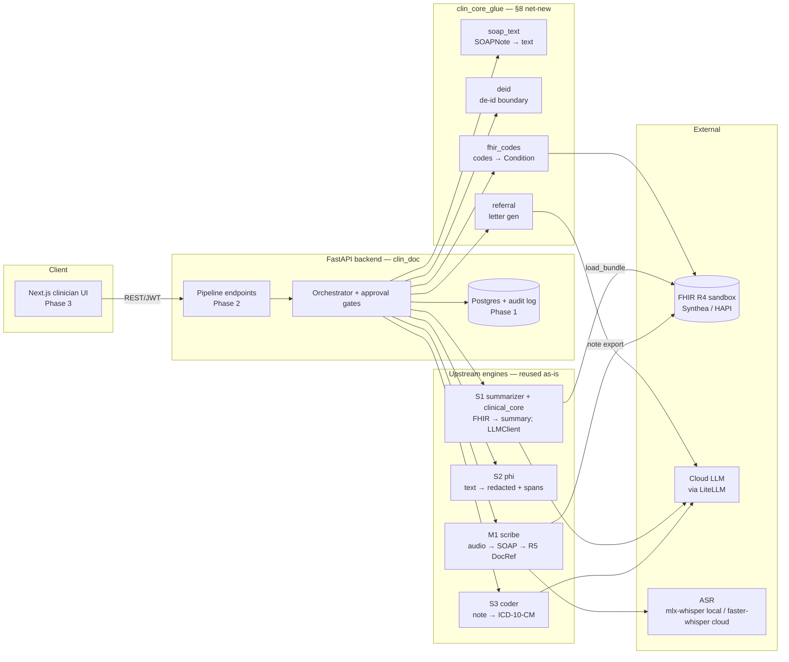

# Clinical Documentation Assistant (B1) — Architecture & Design

> Phase 0 deliverable. System design, data flow, trust boundaries, and the two
> Phase 0 decisions (FHIR version, ASR strategy). Reuses M1/S2/S3/S1 as-is;
> the four net-new pieces from §8 live in `packages/clin_core_glue/`.

## 1. Overview

A full-stack product that takes a consultation from audio to finished
documentation:

```
record → transcribe → de-identify → SOAP note → suggested codes → referral letter → FHIR write-back
```

…all behind an edit-and-approve clinician UI with an audit trail. Three
earlier portfolio projects are integrated into one application; the work here
is **wiring** plus the four net-new pieces in §8, not re-engineering.

## 2. Architecture



### Components

| Component | Location | Role | Phase |
|---|---|---|---|
| Clinician UI | `frontend/` | Select patient → record → review transcript → edit SOAP → review codes → referral → approve → export | 3 |
| FastAPI backend | `backend/clin_doc/` | Pipeline endpoints + orchestration + auth | 2 |
| Data layer + audit | `backend/clin_doc/` (Phase 1) | Postgres schema + append-only audit log | 1 |
| Net-new glue | `packages/clin_core_glue/` | The four §8 pieces | 2 & 4 |
| Infra | `infra/` | Docker, deploy | 5 |

## 3. Data flow (happy path)

1. **Select patient** — UI picks a patient; backend loads context via
   `clinical_core.fhir.load_bundle` (S1, R4).
2. **Record / upload audio** — `POST /encounters/{id}/audio` stores the WAV.
3. **Transcribe + draft note** — `POST /encounters/{id}/generate-note` calls
   M1 `Scribe.generateDraft(audio, ctx) -> Draft` (transcription + SOAP note,
   side-effect-free).
4. **Review transcript + edit SOAP** — UI shows the draft; clinician edits →
   `EditedDraft`.
5. **Suggest codes** — backend flattens the edited note via
   `clin_core_glue.soap_text.flatten_soap`, de-identifies via
   `clin_core_glue.deid.redact_for_cloud`, then calls
   `auto_medical_coder.code(redacted_text) -> list[CodeSuggestion]` (S3).
6. **Generate referral** — `clin_core_glue.referral.generate_referral` (new
   LLM call via `clinical_core.llm.LLMClient`) on the de-identified copy.
7. **Approve** — clinician approves note + codes + referral; approval records
   written to the audit log (the gate).
8. **FHIR export** — note via M1 `Scribe.approveAndExport` (R5
   DocumentReference); codes via `clin_core_glue.fhir_codes.codes_to_conditions`
   (R4 Condition). Nothing is exported without an approval record.

## 4. Trust boundaries & de-identification (§8 point 1)

```
                  ┌──────────── trust boundary (cloud LLM) ────────────┐
 clinician-facing │                                                     │
 canonical copy   │  deidentify() ──▶ redacted copy ──▶ S3 code()       │
 (DB + UI, real   │                  (transcript/note)   referral gen   │
  identifiers)    │                                     via LLMClient   │
                  └─────────────────────────────────────────────────────┘
```

- The **canonical encounter** (stored in the DB — SQLite for dev, Postgres for
  production — and shown in the UI) is **un-redacted** — a clinician needs
  real identifiers to chart correctly.
- Before any text crosses into a **cloud LLM call** — `suggest-codes` (S3) or
  `generate-referral` (new) — S2's `deidentify()` is applied to that copy.
- M1's `generateDraft` is 100% local (mlx-whisper + ollama); no cloud LLM, so
  no de-id needed on the transcription/note-drafting path.
- The **audit log** records every de-id event (counts/types only, never the
  PHI value — per S2's `AuditEntry`).

## 5. The four net-new pieces (§8 → `clin_core_glue`)

| §8 | Module | What | Phase |
|---|---|---|---|
| 1 | `deid.py` | de-id boundary helper wrapping `phi.deidentify.deidentify` | 2 |
| 2 | `soap_text.py` | flatten `SOAPNote.all_claims()` → text before `code()` | 2 |
| 3 | `referral.py` | referral letter gen via `clinical_core.llm.LLMClient` | 2 |
| 4 | `fhir_codes.py` | approved `CodeSuggestion` → R4 `Condition`/`Claim` | 4 |

Everything else (transcription, note drafting, code suggestion, patient-context
loading) is pure reuse of the §7 entrypoints.

## 6. Phase 0 Decision A — FHIR version

**Decision: R4 is the app's canonical FHIR version for context loading and the
net-new Condition/Claim mapping. M1's R5 `DocumentReference` is reused as-is
for note export.**

Rationale:
- Synthea (the data source, §5) emits **R4**.
- S1's `clinical_core.fhir.load_bundle` reads **R4** and is reused as-is.
- HAPI/Synthea sandboxes are **R4** — the typical demo target.
- The net-new `Condition`/`Claim` resources (§8.4) are therefore **R4**,
  validated with `fhir.resources` R4 classes.
- M1's `FhirExporter.toDocumentReference` emits **R5** and is reused as-is
  (Phase 4 forbids hand-rolling a second builder). The note `DocumentReference`
  (R5) and the `Condition`/`Claim` (R4) are exported as **separate** resources,
  not one transaction bundle, so no version-mixed bundle is produced.

Fallback (only if the Phase 5 demo sandbox is R4-only and rejects R5): a thin
R5→R4 down-converter in `clin_core_glue` (B1's adapter layer, **not** in M1).
DocumentReference R5→R4 is mostly field renames; deferred unless needed.

`fhir.resources>=8.0` supports both R4 and R5 via separate class hierarchies,
so both live in one environment without conflict.

## 7. Phase 0 Decision B — ASR / transcription strategy

**Decision: local dev uses M1's `mlx-whisper` (Apple Silicon); the cloud demo
swaps to `faster-whisper` (CTranslate2, CPU-friendly, cross-platform, same
Whisper weights), wired as a B1 adapter — not a rewrite of M1.**

How (no M1 rewrite):
- M1's `Transcriber` ABC (`scribe.dialogue.transcriber.base.Transcriber`) has
  one method: `transcribe(audio) -> list[TranscriptSeg]` + `identifier`.
- B1 implements `FasterWhisperTranscriber` conforming to that ABC.
- B1 constructs the `Scribe` graph directly:
  `Scribe(dialogue_extractor=DialogueExtractor(transcriber=FasterWhisperTranscriber(...), diarizer=NullDiarizer()), note_generator=..., ...)` —
  the same construction M1's `build_scribe` does, but with B1's transcriber
  injected. This is adapter-level wiring in B1, not editing M1's factory.
- M1's `build_scribe` factory (which imports `MlxWhisperTranscriber` at call
  time) is still used for the local Apple-Silicon dev path.

The same question applies to `ollama` serving M1's note-generation LLM:
confirm the cloud host can run it, or swap that piece too (Phase 5 verifies).
If neither fits the Phase 5 time-box, fall back to pre-baked
audio→transcript pairs for the demo only — but `faster-whisper` is the
preferred path so the demo does real transcription.

## 8. Upstream entrypoints (confirmed 2026-07-01)

| Engine | Entrypoint | Notes |
|---|---|---|
| M1 | `scribe.composition.build_scribe(cfg) -> Scribe`; `Scribe.generateDraft(audio, ctx) -> Draft`; `Scribe.approveAndExport(edited, approver) -> DocumentRef` | `scribe.domain.types`: `Audio`, `PatientContext`, `Draft`, `EditedDraft`, `Approver`, `DocumentRef`, `SOAPNote` (`all_claims()`), `Claim`, `SpanRef`. R5 export. Local-only runtime. |
| S2 | `from phi.deidentify import deidentify; deidentify(text, config=None) -> DeidResult` | `DeidConfig(strategy="mask", use_rules, use_ner, use_llm, ...)`. `mask` needs no key. NER loads `en_core_web_lg` only when `use_ner=True`. |
| S3 | `from auto_medical_coder import code; code(note, *, note_id=None) -> list[CodeSuggestion]` | `CodeSuggestion(code, description, confidence, evidence: EvidenceSpan, rank)`. Needs built catalogue + Chroma index + API key. Default `MODEL=anthropic/claude-sonnet-4-5` (stale — §11). |
| S1 | `from summarizer.pipeline import summarize; summarize(record, *, client=None, judge=None) -> Summary`; `from clinical_core.fhir import load_bundle; load_bundle(path) -> PatientRecord` | `clinical_core.llm.LLMClient.complete(system, user, schema) -> T`. R4 loader. Default `LLM_MODEL=anthropic/claude-opus-4-8`. |

## 9. Environment contract

| Variable | Used by | Purpose |
|---|---|---|
| `DATABASE_URL` | backend (Phase 1) | DB connection — SQLite by default for local dev, Postgres in production. Also gates `assert_production_secrets`: any non-SQLite URL requires a real `JWT_SECRET` |
| `JWT_SECRET` / `JWT_ALG` / `JWT_TTL_MINUTES` | backend (Phase 2) | Auth |
| `API_KEY` | S1, S2, S3 (shared) | Cloud LLM key (LiteLLM) |
| `LLM_MODEL` | S1 / clinical_core, S2 | Summarizer + referral + S2 optional pass |
| `MODEL` | S3 | Coder LLM (bump from stale default before Phase 5) |
| `PHI_HASH_KEY` | S2 | Only for `hash`/`surrogate`; `mask` needs none |
| `PHI_REGIONS` | S2 | Phone-region rules (`NZ,AU`) |
| `SCRIBE_AUDIO_SOURCE` | M1 (local dev) | `file` (cloud uses faster-whisper via B1 adapter) |

`LLM_MODEL`/`MODEL` are LiteLLM `"<provider>/<model>"` strings, not a Claude
lock-in — any LiteLLM-supported provider works (`openai/gpt-5`,
`gemini/gemini-2.5-pro`, a local `ollama/...` with no `API_KEY`, etc.); the
`anthropic/...` values are just this repo's default. See `.env.example` for
the full template.

## 10. Phase 0 acceptance

- [x] Monorepo scaffolded: `backend/`, `frontend/`, `packages/clin_core_glue/`, `infra/`, `docs/`.
- [x] M1/S2/S3/S1 added as local path deps; smoke tests prove importable + callable.
- [x] FHIR version decided (§6) and written down.
- [x] ASR strategy decided (§7) and written down.
- [x] Design doc + architecture diagram (this file).
